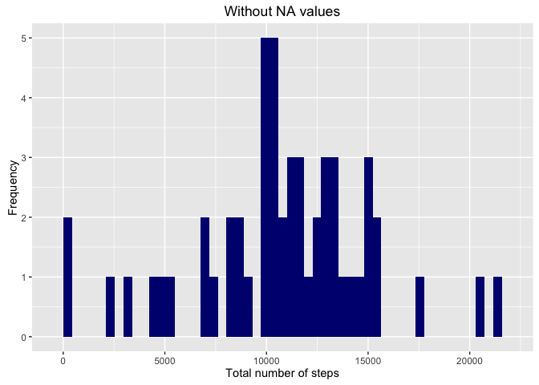
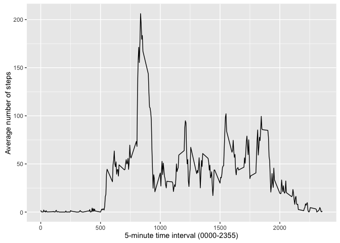
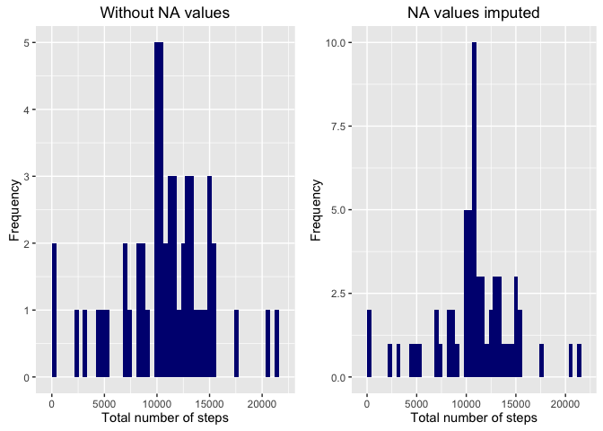
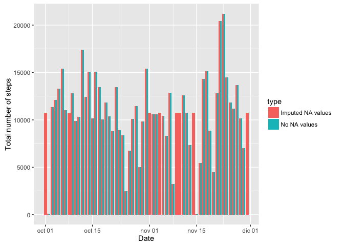
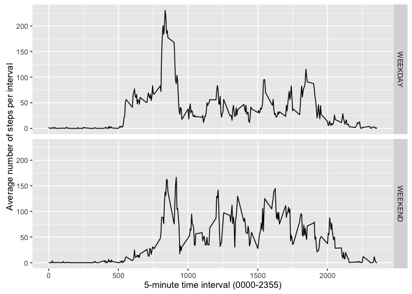

# Reproducible Research: Peer Assessment 1


## Loading and preprocessing the data
The preprocessing of the data includes uncompressing the data zip file, as well as converting the date column to a regular Date format:

```r
unzip("activity.zip")
data <- read.csv("activity.csv", sep = ",", header = TRUE, stringsAsFactors = FALSE, na.strings = "NA")
data$date <- as.Date(data$date, "%Y-%m-%d")
```

The preprocessed data set has the following characteristics:

```r
summary(data)
```

```
##      steps             date               interval     
##  Min.   :  0.00   Min.   :2012-10-01   Min.   :   0.0  
##  1st Qu.:  0.00   1st Qu.:2012-10-16   1st Qu.: 588.8  
##  Median :  0.00   Median :2012-10-31   Median :1177.5  
##  Mean   : 37.38   Mean   :2012-10-31   Mean   :1177.5  
##  3rd Qu.: 12.00   3rd Qu.:2012-11-15   3rd Qu.:1766.2  
##  Max.   :806.00   Max.   :2012-11-30   Max.   :2355.0  
##  NA's   :2304
```

```r
str(data)
```

```
## 'data.frame':	17568 obs. of  3 variables:
##  $ steps   : int  NA NA NA NA NA NA NA NA NA NA ...
##  $ date    : Date, format: "2012-10-01" "2012-10-01" ...
##  $ interval: int  0 5 10 15 20 25 30 35 40 45 ...
```

The variables included in this dataset are:  
- **steps**: Number of steps taking in a 5-minute interval (missing values are coded as NA)  
- **date**: The date on which the measurement was taken in YYYY-MM-DD format  
- **interval**: Identifier for the 5-minute interval in which measurement was taken  

Notice the steps NA values, which will be analysed and imputed later on in this report.  

## What is mean total number of steps taken per day?
For this calculation, we will ignore the NA items.  
The first step of the analysis will be to exclude the missing values and group by date to calculate the total number of steps:

```r
library(dplyr)
```

```
## 
## Attaching package: 'dplyr'
```

```
## The following objects are masked from 'package:stats':
## 
##     filter, lag
```

```
## The following objects are masked from 'package:base':
## 
##     intersect, setdiff, setequal, union
```

```r
result <- data[complete.cases(data),] %>% group_by(date) %>% dplyr::summarise(s = sum(steps))
head(result)
```

```
## Source: local data frame [6 x 2]
## 
##         date     s
##       (date) (int)
## 1 2012-10-02   126
## 2 2012-10-03 11352
## 3 2012-10-04 12116
## 4 2012-10-05 13294
## 5 2012-10-06 15420
## 6 2012-10-07 11015
```

The result is shown in the following histogram:

```r
library(ggplot2)
p1 <- ggplot(result, aes(x = s)) + 
      geom_histogram(bins = 50, fill = "navy") +
      xlab("Total number of steps") + 
      ylab("Frequency") + 
      ggtitle("Without NA values")
p1
```



The mean and median of the total number of steps per day have the following values:

```r
mean(result$s)
```

```
## [1] 10766.19
```

```r
median(result$s)
```

```
## [1] 10765
```

## What is the average daily activity pattern?

In order to examine the pattern, we will group the data by interval to calculate the mean steps, averaged across all days:

```r
result2 <- data[complete.cases(data),] %>% group_by(interval) %>% dplyr::summarize(m=mean(steps))
head(result2)
```

```
## Source: local data frame [6 x 2]
## 
##   interval         m
##      (int)     (dbl)
## 1        0 1.7169811
## 2        5 0.3396226
## 3       10 0.1320755
## 4       15 0.1509434
## 5       20 0.0754717
## 6       25 2.0943396
```

The resulting data gives us the average daily activity pattern, as shown in the following time series plot:

```r
ggplot(result2, aes(x = result2$interval, y = result2$m)) +
      geom_line() +
      ylab("Average number of steps") +
      xlab("5-minute time interval (0000-2355)")
```



The 5-minute interval that contains the maximum number of steps, on average across all the days in the dataset, is the following:

```r
max <- filter(result2, m == max(m))
max$interval
```

```
## [1] 835
```


## Imputing missing values
The first examination of the data set led us to conclude that the only column presenting missing values is the steps column:

```r
summary(data)
```

```
##      steps             date               interval     
##  Min.   :  0.00   Min.   :2012-10-01   Min.   :   0.0  
##  1st Qu.:  0.00   1st Qu.:2012-10-16   1st Qu.: 588.8  
##  Median :  0.00   Median :2012-10-31   Median :1177.5  
##  Mean   : 37.38   Mean   :2012-10-31   Mean   :1177.5  
##  3rd Qu.: 12.00   3rd Qu.:2012-11-15   3rd Qu.:1766.2  
##  Max.   :806.00   Max.   :2012-11-30   Max.   :2355.0  
##  NA's   :2304
```

The total number of missing values in the set is the following:

```r
missingdata <- filter(data, is.na(steps))
length(missingdata$steps)
```

```
## [1] 2304
```
<<<<<<< HEAD

A graphical depiction of the NA distribution follows:

```r
library(VIM)
```

```
## Loading required package: colorspace
```

```
## Loading required package: grid
```

```
## Loading required package: data.table
```

```
## 
## Attaching package: 'data.table'
```

```
## The following objects are masked from 'package:dplyr':
## 
##     between, last
```

```
## VIM is ready to use. 
##  Since version 4.0.0 the GUI is in its own package VIMGUI.
## 
##           Please use the package to use the new (and old) GUI.
```

```
## Suggestions and bug-reports can be submitted at: https://github.com/alexkowa/VIM/issues
```

```
## 
## Attaching package: 'VIM'
```

```
## The following object is masked from 'package:datasets':
## 
##     sleep
```

```r
par(mfrow=c(1,2))
marginplot(data[,c(3,1)])
marginplot(data[,c(2,1)])
```


The plots indicate that the missing values appear only for specific days (2nd plot) and all the intervals (1st plot).  
=======
g
>>>>>>> master
The chosen criteria to impute the missing values will be to assign them the mean of the number of steps per interval:

```r
library(plyr)
```

```
## -------------------------------------------------------------------------
```

```
## You have loaded plyr after dplyr - this is likely to cause problems.
## If you need functions from both plyr and dplyr, please load plyr first, then dplyr:
## library(plyr); library(dplyr)
```

```
## -------------------------------------------------------------------------
```

```
## 
## Attaching package: 'plyr'
```

```
## The following objects are masked from 'package:dplyr':
## 
##     arrange, count, desc, failwith, id, mutate, rename, summarise,
##     summarize
```

```r
imputemean <-function(x) replace(x, is.na(x), mean(x, na.rm = TRUE))
data2 <-ddply(data, ~ interval, transform, steps = imputemean(steps))
```

Finally, we will reorder the imputed data by date and interval:

```r
data2 <- data2[order(data2$date, data2$interval),]
head(data2)
```

```
##         steps       date interval
## 1   1.7169811 2012-10-01        0
## 62  0.3396226 2012-10-01        5
## 123 0.1320755 2012-10-01       10
## 184 0.1509434 2012-10-01       15
## 245 0.0754717 2012-10-01       20
## 306 2.0943396 2012-10-01       25
```

Now, let's calculate the total number of steps taken each day with this new set including the imputing values:

```r
result3 <- data2 %>% group_by(date) %>% dplyr::summarize(s = sum(steps))
result3
```

```
## Source: local data frame [61 x 2]
## 
##          date        s
##        (date)    (dbl)
## 1  2012-10-01 10766.19
## 2  2012-10-02   126.00
## 3  2012-10-03 11352.00
## 4  2012-10-04 12116.00
## 5  2012-10-05 13294.00
## 6  2012-10-06 15420.00
## 7  2012-10-07 11015.00
## 8  2012-10-08 10766.19
## 9  2012-10-09 12811.00
## 10 2012-10-10  9900.00
## ..        ...      ...
```

The data is shown graphically in the following histogram, side by side with the previous histogram calculated without imputing the NA values:

```r
p2 <- ggplot(result3, aes(x = s)) + 
      geom_histogram(bins = 50, fill = "navy") +
      xlab("Total number of steps") +
      ylab("Frequency") +
      ggtitle("NA values imputed")
library(gridExtra)
grid.arrange(p1, p2, ncol=2)
```

<<<<<<< HEAD

=======

>>>>>>> master

The new mean and median of the total number of steps taken per day have the following values:

```r
mean(result3$s)
```

```
## [1] 10766.19
```

```r
median(result3$s)
```

```
## [1] 10766.19
```

The mean has the same value as the one calculated without imputing the missing values, whereas the median differs slightly.  

As the missing values appear only in certain dates, for all the intervals in the day, the total number of steps per day only differs from the base data set in those dates, as show in the following barplot:

```r
result$type <- "No NA values"
result3$type <- "Imputed NA values"
result_all <- merge(result, result3, by=c("date", "type", "s"), all=TRUE)
ggplot(result_all, aes(x=date, y=s)) + 
      geom_bar(aes(fill=type), stat="identity", position="dodge") + 
      xlab("Date") + 
      ylab("Total number of steps")
```

<<<<<<< HEAD

=======

>>>>>>> master


## Are there differences in activity patterns between weekdays and weekends?
In order to identify weekdays and weekends in our dataset, first of all we will create a factor variable, so that we can divide the analysis and the plotting by its levels:

```r
library(chron)
data2$weekend = as.factor(chron::is.weekend(data2$date))
levels(data2$weekend) <- c("WEEKDAY", "WEEKEND")
```

The following plots show the mean of steps by interval both for weekends and weekdays:

```r
result4 <- data2 %>% group_by(weekend, interval) %>% dplyr::summarize(s = mean(steps))
ggplot(result4, aes(x = interval, y = s)) +
      geom_line() +
      ylab("Average number of steps per interval") + 
      xlab("5-minute time interval (0000-2355)") +
      facet_grid(weekend ~ .)
```

<<<<<<< HEAD

=======

>>>>>>> master

The pattern shows that for weekdays, the highest number of steps occur at early morning intervals, matching the commuting time. Wheareas, for weekends, the pattern is more uniform and the peak at early morning intervals is not as noticeable.
